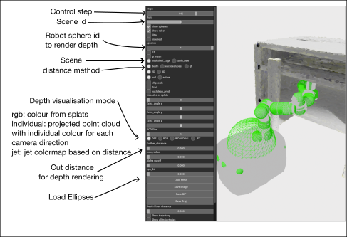

# 
<p align="center">

  <h1 align="center"> ReMoSPLAT: Reactive Mobile Manipulation Control on a Gaussian Splat</h1>
  <p align="center"> 
    <a href="https://nmarticorena.github.io/"><strong>Nicolas Marticorena</strong></a>
    ·
    <a href="https://www.tobiasfischer.info/"><strong>Tobias Fischer</strong></a>
    ·
    <a href="https://nikosuenderhauf.github.io/"><strong>Niko Suenderhauf</strong></a>
    .
  </p>
  <p align="center"><strong>Queensland University of Technology</strong></p>
  <h3 align="center"><a href= "https://arxiv.org/abs/2512.09656">arXiv</a> | <a href="https://huggingface.co/datasets/nmarticorena/ReMoSplat-scenes">Dataset</a></h3>
  <div align="center"></div>
</p>

## Dependencies

Most dependencies can be installed via either `pip` or `conda`. However, we instead follow a **git submodule approach**, which offers the following advantages:

- Our forks of key libraries include small additional features and updated build backends.
- By changing the build backend, we can install the libraries in editable mode using **pixi** (as `setuptools` is incompatible), allowing easier tweaking of underlying dependencies.

If you need to update any dependency to retrigger compilation of the C/C++ extensions, run:

```bash
pixi reinstall <library-name>
```

For example, if you modify `gsplat`:

```bash
pixi reinstall gsplat
```

### Included dependencies

| Name | Description |
|:-------| :---------------|
| **gsplat** | Gaussian Splatting implementation from NeRFStudio. We apply a patch for 2D depth rendering (https://github.com/nerfstudio-project/gsplat/issues/477). |
| **neural_robot** | Wrapper around the Robotics Toolbox for Python, exposing functionality in PyTorch. |
| **nerf_tools** | Scripts for managing NeRF-style datasets and recordings. |
| **safer-splats** | Utilities for sphere-to-ellipsoid distance computation. |


## Getting Started

To ensure reproducible installation, we use the package manager **[pixi](https://pixi.sh/latest/)**.  
If you haven’t installed it yet, run:

```bash
curl -fsSL https://pixi.sh/install.sh | bash
```

*After installation, restart your terminal or reload your shell configuration so the changes take effect.*  
See the **[pixi documentation](https://pixi.sh/latest/)** for more details.

Clone the repository and install dependencies:

```bash
git clone --recursive git@github.com:nmarticorena/RemoSplat.git
cd RemoSplat
pixi install
```

Once installation is complete, activate the environment with:

```bash
pixi shell
```


## Download Scenes

The synthetic scenes described in the paper are available on Hugging Face:

👉 https://huggingface.co/datasets/nmarticorena/ReMoSplat-scenes

These datasets follow the standard NeRF-style format, where camera poses are stored in a `transforms.json` file.

For quicker testing, we also provide a **smaller sample dataset**:

👉 https://huggingface.co/datasets/nmarticorena/ReMoSplat-scenes-sample

Download it using the Hugging Face CLI:

```bash
hf download nmarticorena/ReMoSplat-scenes-sample --repo-type dataset --local-dir data/scenes
```

To download the full dataset:

```bash
hf download nmarticorena/ReMoSplat-scenes --repo-type dataset --local-dir data/scenes
```


## Train Splats

We follow the training workflow from **[gsplat](https://github.com/nerfstudio-project/gsplat)**.  
If your dataset consists of posed depth images, our `compute-aabb` script is useful. It preprocesses the dataset to compute bounding boxes, estimate normals, and subsample points from dense point clouds.

View available options with:

```bash
compute-aabb --help
```

An example training pipeline for our synthetic scenes is provided in:

```
scripts/training/rmmi/train_scene.sh
```

Run:

```bash
bash scripts/training/rmmi/train_scene.sh table N
bash scripts/training/rmmi/train_scene.sh bookshelf N
```

Where **`N`** is the number of scenes (out of 500) to train.  
If using the sample dataset, set `N=10`.


## Run the Controller

The controller implementation is located in:

```
remo_splat/controller.py
```

Multiple distance metrics are implemented in:

```
remo_splat/lidar.py
```

Control hyperparameters are defined in:

```
remo_splat/configs/controllers.py
```

To run the simulated benchmark:

```bash
python3 scripts/benchmark/rmmi.py --n-scenes N
```

Where **`N`** is the number of scenes to evaluate.


## Visualize Behaviours

Controller outputs are stored in:

```
logs/{exp_name}/{sim_frequency}
```

You can visualise them with:

```bash
python remo_splat/experiment_visualizer.py --folder-name {exp_name}/{frequency} --env-names [scene_names ...] --robot-name curobo
```

This will open:

- one 3D visualisation window
- one depth rendering window showing the depth rendering from one of the spheres that represent the robot geometry (determined by the robot_sphere_id)



## Acknowledgements

Our approach builds upon several excellent open-source projects.  
We thank the authors of **[gsplat](https://github.com/nerfstudio-project/gsplat)** for their implementation of both 3D and 2D Gaussian Splatting, and the authors of **[safer-splat](https://github.com/chengine/safer-splat)** for the PyTorch implementation of the sphere-to-ellipsoid distance described in **[Geometric Tools](https://geometrictools.com/Documentation/DistancePointEllipseEllipsoid.pdf)**.

Please consider citing these works accordingly.

## Citation

If you use ReMoSPLAT in your research, please cite:

```bib
@misc{marticorena2025remosplat,
      title={ReMoSPLAT: Reactive Mobile Manipulation Control on a Gaussian Splat},
      author={Nicolas Marticorena and Tobias Fischer and Niko Suenderhauf},
      year={2025},
      eprint={2512.09656},
      archivePrefix={arXiv},
      primaryClass={cs.RO},
      url={https://arxiv.org/abs/2512.09656},
}
```


## Pending

- [ ] Add cyclonedds as a conda package to simplify installation of the NeRFCapture scripts
